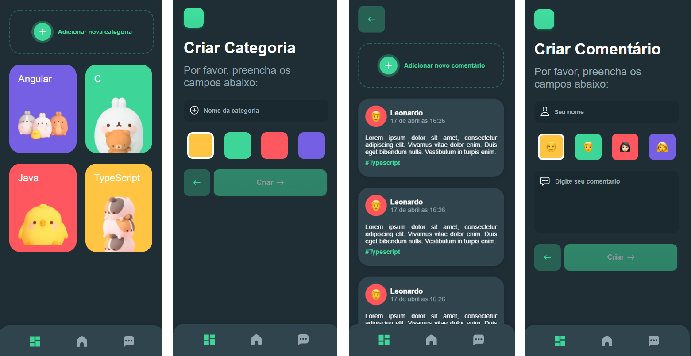

<h1 align="center"> Bird App </h1>

    

<h3 align="center">A simple application to create categories and comments about something that you like.</h3>

 <h4>Based on LIGA-Facens opportunity course. 🎮</h4>

## ⚙️ Technologies

this project was developed with: 

- [Angular](https://angular.io/docs)
- [Ionic](https://ionicframework.com/docs)
- [NestJS](https://nestjs.com/)
- [Capacitor](https://capacitorjs.com/docs)
- [Node.js](https://nodejs.org/en/)

## 📱 Layout

The layout was designed in Figma and inspired by [Marvie](https://www.figma.com/community/file/827876058453173134), you can access it by [clicking here.](https://www.figma.com/file/KcVKBsnGMDucY0llgCqwdt/Bird-App).

### 📓 Entities and Relationship

Entity–relationship model was made with [Mermaid.js](https://mermaid-js.github.io/mermaid/) and you can find it [right here.](./entities.md)

## 📃 License

[MIT License.](LICENSE)
